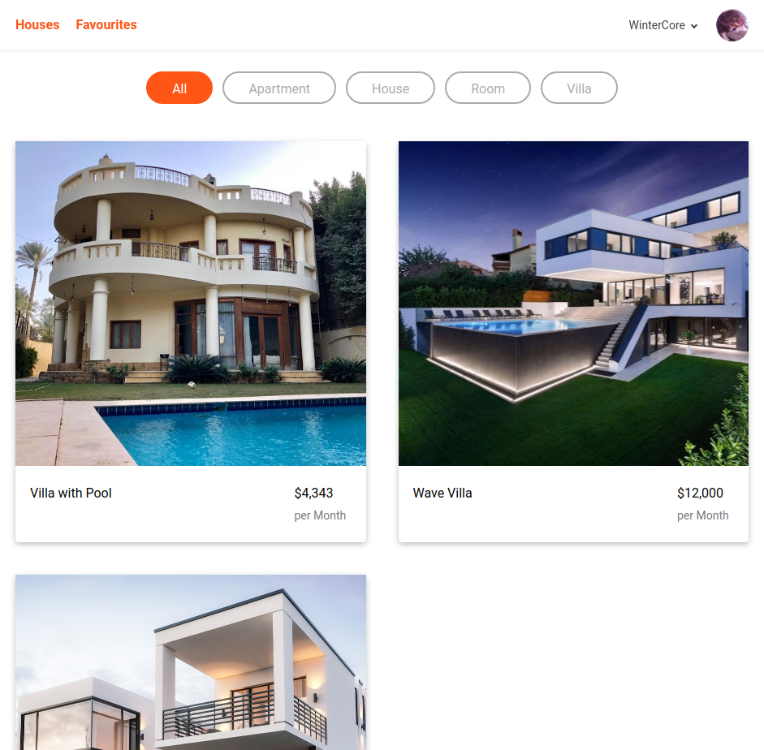

# Houzez

> This application is a place to search for houses to rent or buy.

## Features
- Login using google
- Ability to search for houses and filter them based on their type (house, villa, apartment, etc).
- Ability to favourite/unfavourite houses.
- Ability to view favourited houses.

## Table of Contents
- [Houzez](#houzez)
  - [Features](#features)
  - [Table of Contents](#table-of-contents)
  - [Live Demo](#live-demo)
  - [Rails: How to Run Locally & Run Rspec Tests](#rails-how-to-run-locally--run-rspec-tests)
  - [Running the frontend tests](#running-the-frontend-tests)
  - [API Documentation](#api-documentation)
  - [Built With](#built-with)
  - [Quick Note](#quick-note)
  - [Authors](#authors)
  - [🤝 Contributing](#-contributing)
  - [Acknowledgments](#acknowledgments)
  - [📝 License](#-license)

## [Live Demo](https://houzez.upperdown.me)

## [Rails: How to Run Locally & Run Rspec Tests](HOWTO.md) 

## Running the frontend tests

- Install [Node.js](https://nodejs.org/en/)
- Clone this repository by running `git clone https://github.com/WinterCore/microverse-final-capstone-houzez.git`
- Change your current working directory to the project `cd microverse-final-capstone-houzez`
- Run `npm install`
- Run `npm run test`
- Enjoy

## API Documentation

You'll find the api documentation under the `docs` folder in the root directory of the project.

You can also [click here](https://docs.houzez.upperdown.me) to view the live version of it

## Built With

- Ruby On Rails
- Neovim
- Rubocop
- Stylelint
- Github Actions
- Postgresql
- React

## Quick Note
This project requires ruby >= 2.7.1.
Please do not try to run this project using an older version of ruby.

## Authors

👤 **Hasan Kharouf**

- Github: [@WinterCore](https://github.com/wintercore)

## 🤝 Contributing

Contributions, issues and feature requests are welcome!

Feel free to check the [issues page](issues/).

## Acknowledgments

- Microverse
- [Design](https://www.behance.net/gallery/37706679/Circle-(Landing-page-Dashboard-Mobile-App)) by [Nelson Sakwa](https://www.behance.net/alexey_savitskiy)

## 📝 License

This project is [MIT](LICENSE) licensed.